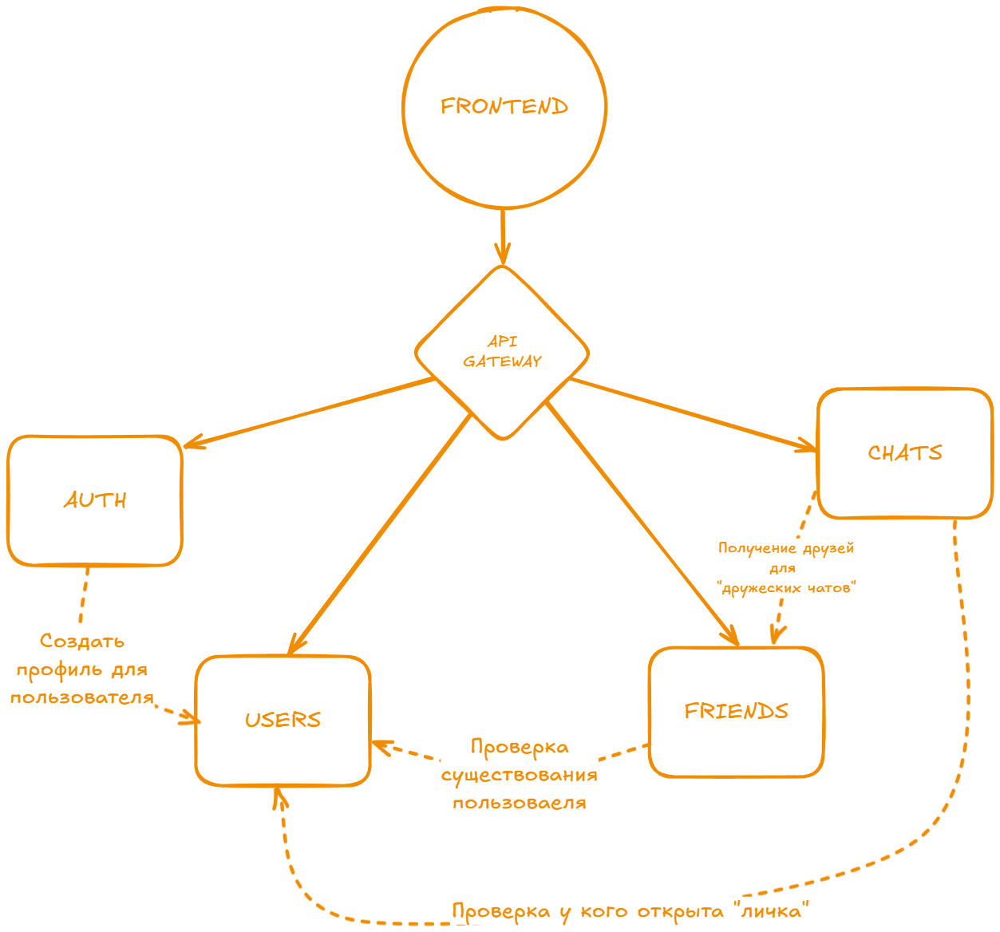

# Описание сервисов

В системе предпологается N сервисов

## Сервис 1. Auth
### Задача: Авторизация и аутентификация пользователей
### Хранит в себе:
- Токены
- Данные сессий
- Хеш пароля и логин
- Права для пользователя или его роли (но пока не предполагается)

### API:
- /register - Регистрация (передаем логин и пароль)
- /login
- /logout
- /refresh-token

### С кем и как взаимодействиет:
- Users Сервис: при регистрации делает запрос на создание профиля (🔶1)
- Передала информации о входе и выходе в какой-нибудь сервис статистики (просто как идея "на будущее")

### База данных:
Postgres - для сохранения информации из других каких-то сервисов (Права юзера, выданные токены и тп)
Redis - кеш для частой инфы (токены) + хранение инфы блокировок для брутфорсеров паролей (10 неправильно введенных паролей на минуту отклоняют все login запросы с этого IP)

### Комментарии и вопросы преподавателю:
(🔶1) Не знаю, что лучше всего использовать, простой запрос в сервис Users при регистрации или какую нибудь очередь
Я бы выбрал запрос, тк если не получится создать профиль для юзера, то и регистровать в данные момент его нельзя (временно ручка работать не будет)

## Сервис 2. Users
### Задача: Работа с инфой о пользователе
### Хранит в себе:
- подробную информацию о пользователе (bio, fio, user_id, city, avatar_url)
- Какие-то настройки для конфиденциальности (можно ли видеть профиль, добавить в друзья, написать)

### API:
- /users, /users/{id} - получить инфу о юзере/юзерах
- GET,PUT /users/me - данные по текущему акку (по токену понять какой текущий юзер)
- POST /users - создать юзера (тянется из Auth сервиса)
- /users/search - поиск по имени, городу и тп

### С кем и как взаимодействиет:
- получает от Auth сервиса запрос на создание профиля при регистрации

### База данных:
Postgres - для хранения инфы о пользователе и тп
S3 - хранение аватарок

### Комментарии и вопросы преподавателю:
Возможно стоит сделать наоборот, пользователь регается через сервис юзеров и потом в Auth сервис подает инфу, что появился новый юзер и сохранить его в сервисе Auth часть инфы о нем (хеш-пароля и логин например)

## Сервис 3. Friends
### Задача: Храненеи дружеских связей пользователей друг с другом
### Хранит в себе:
- Связи кто с кем других, и св-во связей (друзья, коллеги, лучшие друзья)

### API:
- POST /request - отправить запрос на дружбу
- /request/accept - отвергнуть запрос
- /request/reject - принять запрос
- /remove - удалить друга
- /opened_requests - список запросов в друзья
- /list - список друзей
- /add_tag - пометить дружескую связь (друзья, коллеги, лучшие друзья)

### С кем и как взаимодействиет:
- Работа с Users сервисом для проверки существования пользователей (🔶1)
- Работа с Notifications сервисов для отпраки уведомления о новом запросе на дружбу

### База данных:
Neo4J - в целом можно попробовать как в примерах Facebook из книжек, для поиска общих друзей и искать друзей общих в глубину
Postgres - ну или классика

### Комментарии и вопросы:
(🔶1) Думаю можно через очереди сделать согласованность БД Друзей при удалении пользователя, и при отправки запроса на друбжу через синхронный вызов спрашивать у Users сервиса о существовании пользователя

## Сервис 4. Chats
### Задача: Работа с сообщениями в чатах и беседах
### Хранит в себе:
- Чаты и их участники
- Сообщения

### API:
- POST,PUT /group_chats - создать групповой чат, изменить название и тп
- /group_chats/add_user - добавить участников группового чата
- /group_chats/{id}/history - сообщения чата
- /all_chats/list - список чатов 
- /msg/{id}/read - пометить сообщение прочитанным
- PUT,DELETE /msg/{id} - удаление или изменение сообщения в чате (всё равно вести историю изменения сообщения в другой таблице)
- /users_chat/{user_id} - по токену получаение инфы о личном чате с другим юзером
- /users_chat/{user_id}/history - по токену получаение инфы о личном чате с другим юзером

### С кем и как взаимодействиет:
- с Users и Friend сервисом при проверке можно ли отправить сообщение если ты ему не друг и если нельзя, то друг ты ему
- с Notifications сервисом для информаровании о новом сообщении

### База данных:
Postgres - история сообщений и чаты
Redis - кешировать проверки п1 из блока "С кем и как взаимодействиет"

### Комментарии и вопросы:
Много намутил с личными чатами и чатами групповыми, но в целом терпимо как я думаю

## Сервис 5. Notifications
### Задача: отправлять инфу о новых уведомлениях
### Хранит в себе:
- Уведомления и кому предназначены

### API:
- POST /notifications - создать уведомление для пользователя
- /notifications/{id}/read - пометить уведомление прочитанным

### С кем и как взаимодействиет:
- Из других сервисов инфу принимает

### База данных:
MongoDB - можно условно и нереляционной бд обойтись для хранения неотправленных уведомлений
Append-only DB - для хранения историй уведомлений

### Комментарии и вопросы:
Тут я бы сделал сервис на вебсокете для отправки клиенту уведомлений + воркер их чистки для случаев их неактуальности через какое-то время.

По поводу БД тоже намудрил, можно и реляционкой сделать полностью, так как надо будет ещё на самом сайте у колокольчика показывать историю уведомлений. для оптимизации можно думаю партицировать БД по полю Прочитано, Отправлено.
